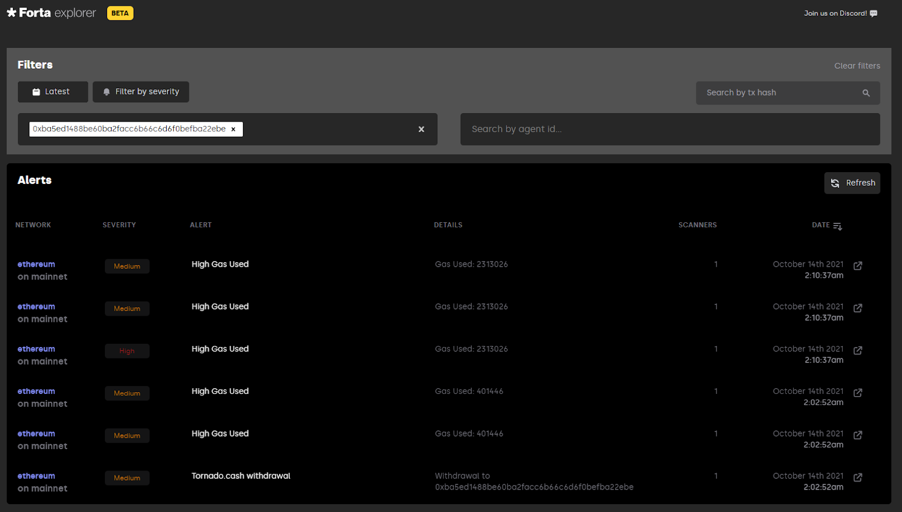

# Security Solutions For Compound Governance

## Summary

A proposal to implement Security Solutions to prevent and mitigate loss of funds resulting from security risks introduced by community-proposed upgrades to the Compound protocol.

## Background

For the past two years, OpenZeppelin has worked formally and informally with Compound to:

* Perform [10+ security audits](https://blog.openzeppelin.com/?s=compound) of the Compound protocol
* Develop [OpenZeppelin Governor](https://blog.openzeppelin.com/governor-smart-contract/), a standardized version of GovernorAlpha and GovernorBravo governance contracts, part of OpenZeppelin’s widely used open-source [Contracts Library](https://github.com/OpenZeppelin/openzeppelin-contracts)
* Introduce smart contract security best practices guidelines, including [strategies for safer governance systems](https://blog.openzeppelin.com/smart-contract-security-guidelines-4-strategies-for-safer-governance-systems/)
* Incubated the [Forta Protocol](https://forta.org), the first decentralized runtime security protocol to prevent or mitigate smart contract exploits as they occur, and has developed bespoke [agent scripts monitoring Compound](https://github.com/forta-protocol/forta-agent-examples/tree/master/compound-ts) on Ethereum mainnet.

During that time, OpenZeppelin developed deep expertise and set industry standards on secure smart contract development, including best practices on protocol functionally, incentive structures, oracle integrations, and governance processes for protocols like Compound.

As events from the past weeks demonstrate, governance upgrades can introduce new security risk vectors that could result in reputational damage to the protocol and possible loss of user funds. A proven way to mitigate risk is performing ongoing security audits. OpenZeppelin prides itself on auditing each line of code manually; automated code analysis tools are no substitute for seasoned, dedicated professionals with deep knowledge of smart contract security.

However, as helpful as security audits and code libraries are in identifying or preventing vulnerabilities in code, effective security requires a continuous and holistic approach. 

## Proposal

In the following sections, we outline the case and scope for OpenZeppelin to develop a comprehensive set of best-in-class Security Solutions for Compound throughout all stages of the governance proposal lifecycle:

## Security Advisory

OpenZeppelin will provide a dedicated Protocol Security Officer (PSO) to act as Compound’s security advisor. The PSO will be the main point of contact for the Community and provide advice and guidance to help improve and maintain Compound’s governance process using industry best practices.

The PSO’s advice, guidance, and feedback will be focused on:

* Governance process improvements
    * Incorporating security audits and input from security experts throughout the proposal lifecycle
    * Setting up procedures for threat detection, monitoring, and alerting 
    * Process recommendations on use of timelock; and specific recommendations on how to extend Pause Guardian functionality into incident response procedures
* Community support by answering smart contract development security related questions during the governance proposal creation process, including:
    * Development best practices based on known and potential attack vectors, and types of vulnerabilities to avoid
    * Recommendations on available market solutions (security tools, bug bounties, services) for improving overall technical risk

## Security Training 

In order to reduce the probability of introducing new security risks in new proposals, the PSO, together with OpenZeppelin’s Education team, will provide tailored training and resources to the Community on secure smart contract development best practices. OpenZeppelin will host bi-annual workshops led by senior smart contract security researchers including: 

* An additional set of four workshops to outline and educate the community on unique aspects of Compound’s security landscape
* A customized, six-session training course to take place over the span of three months 
* Unique course materials and certifications for all attendees, which could become a potential requirement for community members to introduce new governance proposals

For examples of educational content developed by OpenZeppelin, please refer to our Secure Smart Contract Development Series on [Strategies for Safer Governance systems](https://blog.openzeppelin.com/smart-contract-security-guidelines-4-strategies-for-safer-governance-systems/), [The Dangers of Price Oracles](https://blog.openzeppelin.com/secure-smart-contract-guidelines-the-dangers-of-price-oracles/), [Strategies for Secure Access Controls](https://blog.openzeppelin.com/workshop-recap-secure-development-workshop-2/), and [The Dangers of Token Integration](https://blog.openzeppelin.com/workshop-recap-secure-development-workshop-1/).

## Security Audits

OpenZeppelin will continuously audit and provide actionable security recommendations on new governance proposals. OpenZeppelin will assign a dedicated team of security auditors to review proposed changes on an ongoing basis, and will verify that the transaction to be executed matches the code submitted. The Compound protocol will be audited as these changes occur within the governance process, and the related deliverables will be communicated upon an agreed-upon schedule. 

For new governance proposals that meet an agreed-upon threshold (e.g. minimum # of votes), OpenZeppelin will commit to provide within an agreed-upon time frame:

* A detailed report with an actionable description of any issue found
* An outline of potential exploitable vulnerabilities in the code and any unexpected behavior caused by errors in the architecture and/or logic, and additional recommendations to increase security, and a general analysis of the contract dynamics reflecting state-of-the-art security patterns 
* All governance proposals including parameter changes will be reviewed and audited
* A classification of issues according to severity with proposed, concrete fixes
* A review of any fixes to issues identified in the audit process

As the first step in implementing this Solution, OpenZeppelin will perform an initial, comprehensive audit of Compound’s deployed smart contracts over a fixed period of time. For examples of OpenZeppelin’s security audit reports, please see our [blog](https://blog.openzeppelin.com/security-audits/).

## Threat Detection Monitoring and Alerting

In order to enable faster issue prevention and mitigate the risk associated with newly passed proposals OpenZeppelin will provide operational and security monitoring to detect issues and threats during and after the deployment of passed proposals. OpenZeppelin will implement or enhance existing monitoring and alerting systems to provide complete coverage. This will include (as appropriate):

* Setup of comprehensive operational and security monitoring allowing near real-time threat detection of attacks or exploits related to Compound smart contracts and specific governance proposals
* Configuration of alert notifications and dashboards for Compound's designated parties and for OpenZeppelins PSO as appropriate
* Validation that all governance proposals are deployed accurately
* Supply chain monitoring (libraries, oracles or protocols used by Compound Protocol in association with new governance proposals) 

Examples on how the threat detection monitoring and alerting Solution works:

* [Video](https://www.youtube.com/watch?v=FIVr1ao2_X4) demonstrating threat detection developed by OpenZeppelin on the Forta Protocol of the issues encountered after the deployment of Compound’s proposal 062
* Example of an [agent script monitoring the Compound protocol](https://github.com/forta-protocol/forta-agent-examples/tree/master/compound-ts) on Ethereum mainnet
* Screenshot of alert notifications configuration

        

* Screenshot of the Forta Explorer, showing OpenZeppelin-developed alerts from Ethereum mainnet associated with the start of the recent [Indexed Finance exploit](https://ndxfi.medium.com/indexed-attack-post-mortem-b006094f0bdc) on October 15th, 2021, with losses of $16m

## Expectations 

* **Duration:** the nature of Security Solutions requires certain predictability to ensure the availability of teams and resources. Therefore we propose a 1-year engagement given the high and growing demand for smart contract security services.
* **Communications:**  
    * PSO Community responses and recommendations (2 business day/48 hour response time)
    * Audit Reports published as required by community-proposed upgrades to the Compound protocol
    * Initial education event series and Bi-Annual education workshops and training sessions thereafter
    * Monthly forum posts and participation of PSO on community calls with explanation relating to audit and threat reporting
    * Discord Developer & Twitter Spaces Community Calls as necessary
* **[Terms of Service](https://docs.google.com/document/d/e/2PACX-1vR8112-sFz9ERsALvDIPDiCXK2argtPeipE3RSBHuPgJSV600DB16ECAstbFc4TcNGAwgMkOz14rGPE/pub): **applicable to OpenZeppelin’s provision of Security Solutions
* **Out of scope of this proposal:** Setup and administration of bug bounty services, incident and emergency response services not explicitly laid out in this proposal, crisis communications and public relations support, compliance risk management, fees associated with external monitoring services (e.g. future Forta Protocol fees), as well as any other product or service not explicitly described here. 

## Fee Structure

OpenZeppelin charges a service fee for its best-in-class Security Solutions that seeks to be commensurate with the value that our solutions add to protocols. OpenZeppelin also wants to provide a strong signal of our alignment with the protocol. At the start of every quarter for one year OpenZeppelin will create a formal Compound Governance Proposal to update the service fee payment in accordance with the simple formula below:

* Retainer Fee [COMP]
    * $1,000,000/quarter, payable in COMP at the Volume Weighted Average Price of COMP of the previous month (source: Messari)
    * Payable at the beginning of each quarter
* Major Security Event Occurrence (𝞪) [1,0]
    * 𝞪=1 no Major Security Event occurred during the previous quarter 
    * 𝞪=0 major security event has occurred during the previous quarter 
    * “Major Security Event'' means any material smart contract vulnerability that is exploited arising from code audited by OpenZeppelin which causes a major loss of funds to users generally (i.e. a loss is not particular to any specific individual user), or OpenZeppelin audited vulnerabilities that are exploited and cause significant loss of protocol function or service to the community.  OpenZeppelin will not be responsible for events that occur when OpenZeppelin’s audit or governance process recommendations are ignored and not implemented into the Compound Protocol, which are beyond OpenZeppelin’s control.
* Performance Fee [COMP]
    * $1,000,000/quarter, payable in COMP at the Volume Weighted Average Price of COMP of the previous month (source: Messari)
    * Payable at the end of each quarter

## About OpenZeppelin 

OpenZeppelin is the premier smart contract security technology and services company, trusted by the most used DeFi, NFT, and DAO projects. Founded in 2015 with the mission to protect the open economy, OpenZeppelin safeguards tens of billions of dollars in funds for leading crypto organizations including Coinbase, Ethereum Foundation, Compound, Aave, TheGraph, and many others.

## FAQ

1. What is the breakdown of the quarterly payment in terms of services provided by OpenZeppelin? 

    We have tried to keep this simple and aligned with what we believe provides the best security for the protocol.  

    As indicated in the proposal, there are two main components to the fee structure:  The first is directly related to our services, this covers all activity of our auditors, part-time PSO, project management and training personnel.  This also includes our threat management platform and dashboarding solutions.  We have analyzed Compounds  governance and protocol changes over the last 1.5 years, along with the other services bundled into the quarterly offering and estimated this to be 1M/quarter.  Keep in mind that OpenZeppelin’s current base fee per week for audits  is 30-35k/week, and CISO resources base salaries can easily range from 200-300K per year.  Also consider that the software fees underpinning our threat management solutions are included as part of these fees.

    We also have included a performance fee which is largely where we will make our profit, which aligns our efforts to the Compound DAO directly in keeping the protocol safe from any significant security events.   In the first quarter, the only payment will be the service fee.  After the first quarter, assuming no significant events have  occurred, the performance fee will come due at the same time as the next quarters services fee.   

2. How many audits will Compound receive each year? Why is a perpetual audit structure needed when Compound already receives a significant number of audits from OpenZeppelin?

    The goal of this proposal is to move Compound away from ad-hoc last minute audits.  Waiting until the last minute to audit or in some cases not auditing protocol changes is no longer a best practice for an important project like Compound.  OpenZeppelin has analyzed and estimated, based on the last 1.5 years, the average number of protocol changes, along with parameter changes and assumed that every change will be audited on a  continuous basis, hence the term continuous audit in the proposal.  By combining continuous auditing with continuous threat monitoring, Compound will not only improve its overall risk profile and threat surface, but will also move away from last minute, ad-hoc audits.  The budget normally reserved for these ad-hoc audits will be saved and absorbed into this proposal.

    Lastly, but most importantly this approach will redefine the way security is conducted by a DAO; as changes to the protocol get introduced by the community as opposed to a centralized lab, a new more holistic approach is required, one that will strengthen the overall decentralized growth of the protocol.

3. How will the PSO act as a CISO? How will duties be different? Further explain their time commitment? Who is the proposed PSO?

    The PSO will not be a full-time CISO but in many ways will fulfill some functions that reside with a CISO in a traditional organization.  The main function of the PSO as outlined in the proposal is to 1.  Project manage the overall OpenZeppelin services proposed 2.  Make recommendations that improve the overall security of the Compound protocol, particularly focusing on timely response to changes, incidents and emergencies and  3.  Advise and coordinate training and education activities with the Compound community.  It is possible that over time, the PSO could expand to more responsibilities as the Compound security program matures and the need for further full-time information security officer becomes clear to the Community.  We have estimated a fractional but significant percentage of time of one of our most senior audit professionals, someone with both traditional information security expertise along with significant experience auditing and securing smart contracts.  We will introduce the individual once the proposal has been accepted and passed.  

4. What is Forta? Why should we trust it? Does the protocol have limitations/strengths? Who is using it already?

    Forta is the first decentralized runtime security protocol to prevent or mitigate smart contract exploits as they occur. Forta was incubated by OpenZeppelin and launching with support from world-class partners including a16z (a major COMP token holder) Placeholder Ventures, and Coinbase Ventures, among others. 

    Forta allows anyone to develop code scripts - detector agents - to detect specific conditions or events. Forta node operators scan transactions and smart contract data, run detector agent scripts and emit alerts when threats are detected. Protocol devs, token holders, and integrators can subscribe to get real-time alerts on cybersecurity, financial, governance, and operational threats for their own or dependent protocols, enabling them to take defensive action to prevent or minimize loss of funds. UMA, Maker, Perpetual, DCG, Vesper, CREAM, Yearn, Alpha Finance have all already started using Forta.

5. Forta is not a battle tested protocol; what assurances are provided that it will always work? How many nodes are currently running? Is there a potential conflict of interest given OpenZeppelin’s involvement in Forta?

    Forta is a permissionless protocol, OpenZeppelin incubated the project and will remain a key contributor. Forta currently is in early network tests, multiple nodes are being added each week and wider decentralized network testing will begin in early Q1 2022. Forta is a permissionless protocol, all components will be open source and all work will be publicly verifiable.

6. Why is emergency response not included in this proposal? Will OpenZeppelin and PSO do anything at all in the event of a security incident?

    Emergency Response is directly dependent on Compound Governance and the ability to immediately respond to lock, pause, or mitigate threats to the protocol in an emergency situation. As part of this proposal, OpenZeppelin and the PSO will make recommendations to the community on how to effectively respond in a more rapid or instantaneous manner during emergency situations. These recommendations will have to be accepted though the Compound DAO Governance process and be adopted for a more mature emergency process to emerge.

    In parallel, our main focus in this area will be to audit all code changes on a continuous basis as well as to provide continuous threat monitoring. The process by which the DAO responds to emergencies needs to be developed in a thoughtful, effective way. OpenZeppelin and its employees will notify and provide support to the extent of their abilities as required should an incident or emergency occur within the constraints of the current community Governance process. 

7. Specifically, what will the education sessions cover? What is the value added that Compound’s experienced solidity devs do not already have or can gain from free online education?

    OpenZeppelin is one of the leading security firms in the smart contract, DeFI, and NFT space. By conducting hundreds of audits for the most used DeFi and NFT projects and interacting with many of the top development teams in the space, we find that there’s always a struggle between moving fast and building securely. Developers code for speed, efficiency, and functionality. Security is often an afterthought in their development cycles and saved as an activity towards the end. 

    The series will cover three areas 1.  Specific security best practices that all projects should follow when developing code and 2. Security Threats and recent developments in the space that could have impact on the Compound Protocol and 3. Tailored analysis of  areas of interest or concern from the community.

8. How does incident response differ from emergency response and what capacity if any would be OpenZeppelin’s involvement in preparation of solutions?

    Standard information security nomenclature is that an incident differs from an emergency in that an emergency poses an immediate risk and requires urgent attention. As outlined in the proposal OpenZeppelin will notify CompoundLabs and the DAO Community of incidents and emergencies.  The ability to respond to emergencies in an effective and timely manner is directly related to the speed at which the related protocol and governance actions can occur.  Hence the initial focus of the PSO will be to advise and suggest changes to the DAO governance process specifically to improve its abilities to respond to both incidents and emergencies in a timely manner.  Regardless, OpenZeppelin and its employees will notify and provide support to the extent of their abilities as required should an incident or emergency occur within the constraints of the current community Governance process.
